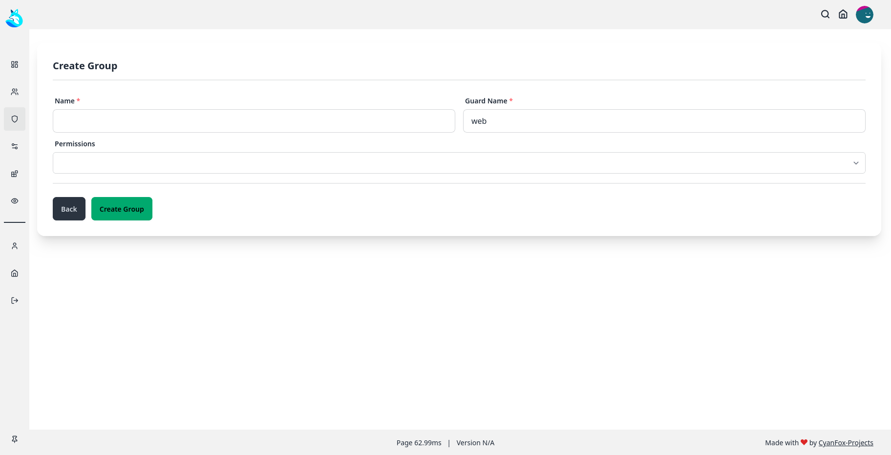
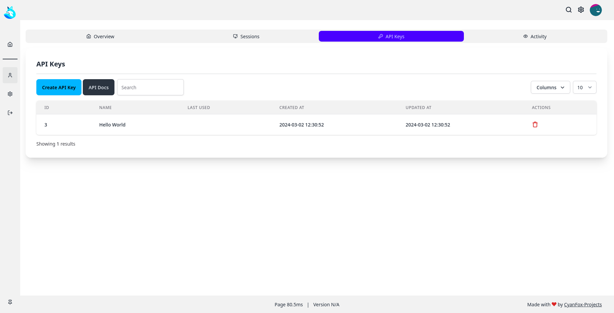
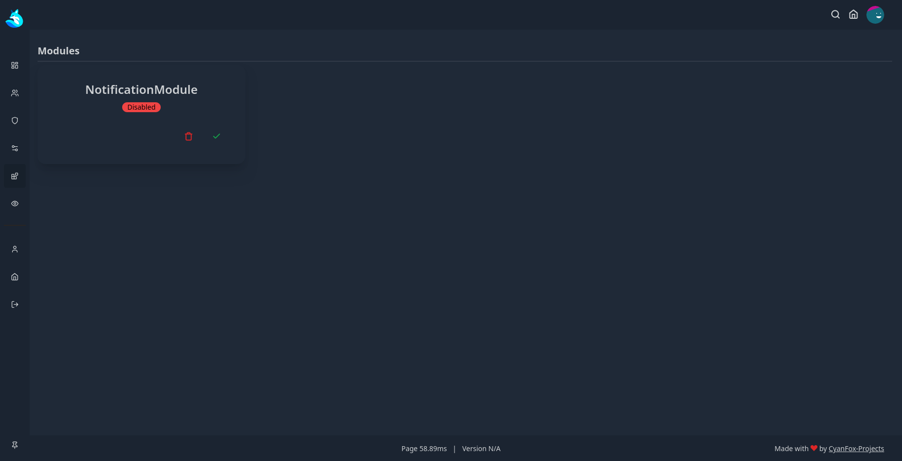

# Laravel-Template

> [!WARNING]
> ## **V2 of the Laravel-Template will be discontinued on 31.12.2024. Please use [V3](https://github.com/CyanFox-Projects/Laravel-Template/tree/v3) instead**

## Documentation

You can find the documentation [here](https://docs.cyanfox.de/docs/laravel-template/v2).

## Support

You can get support on the [CyanFox Discord](https://discord.cyanfox.de).

## License

This project is licensed under the MIT License - see the [LICENSE](LICENSE) file for details.

## Screenshots

White-mode

Dark-mode

Other

